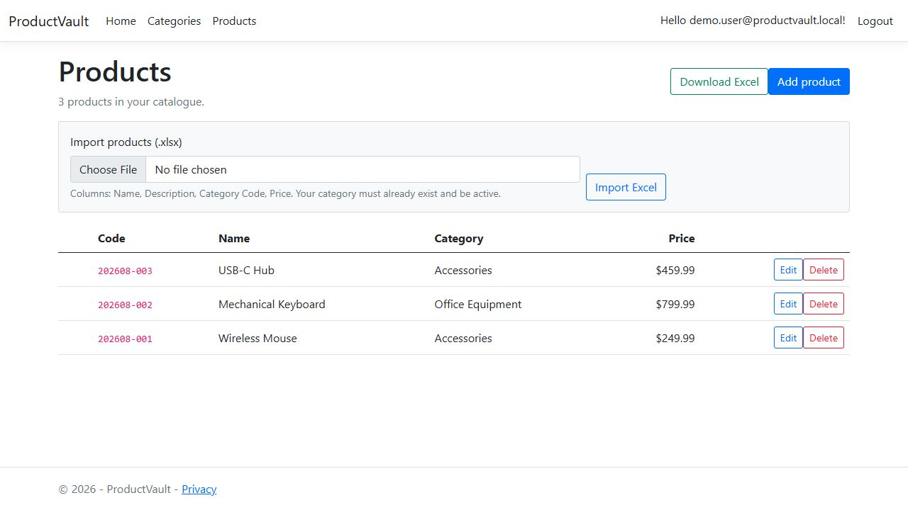
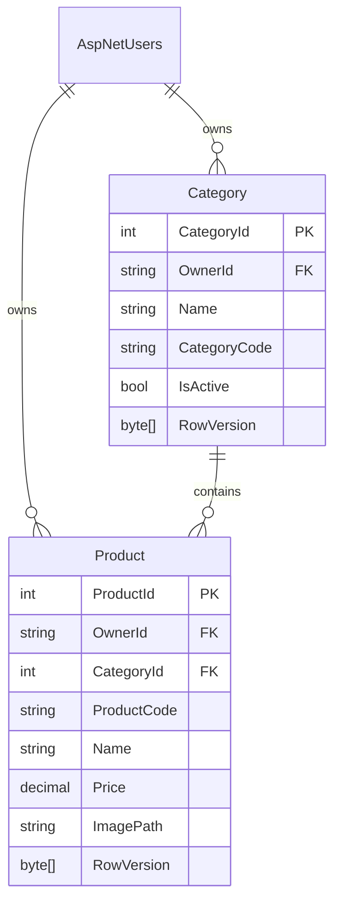

# ProductVault

ProductVault is a .NET 8 ASP.NET Core MVC application for securely managing a private catalogue of categories and products. It also exposes protected JSON API endpoints under `/api/categories` and `/api/products` for integration use.

## Highlights

- ASP.NET Core Identity registration and login; every data query is restricted to the signed-in user's `OwnerId`.
- Category CRUD with per-user unique codes validated as `ABC123`.
- Product CRUD with 10-item paging, image uploads, and database-backed optimistic concurrency (`rowversion`).
- Product codes automatically generated as `yyyyMM-###` inside a serializable transaction.
- Excel import (up to 500 rows) and complete Excel export.
- SQL Server / EF Core migrations, audit fields, antiforgery protection, validation, and error feedback.

## Product workflow preview

The product list gives the user quick access to paging, Excel import/export, and safe edit/delete actions. The screenshot uses a local demonstration account and sample data.



## Prerequisites

- .NET 8 SDK
- SQL Server LocalDB (included with Visual Studio) or SQL Server Express/Developer edition

## Run locally

1. Restore packages: `dotnet restore`
2. Create the schema: `dotnet ef database update`
3. Run: `dotnet run`
4. Open the HTTPS URL displayed in the terminal and register an account.

The default connection is LocalDB in `appsettings.json`. For another SQL Server instance, replace `ConnectionStrings:DefaultConnection` with your server connection string; keep credentials out of source control by using user secrets or environment variables.

## Excel import layout

The first worksheet must have a header row, followed by these columns in order:

| Name | Description | Category Code | Price |
| --- | --- | --- | --- |
| Wireless mouse | Optional text | ACC001 | 249.99 |

The named category must already be active in the current user's account. Product codes are always generated by the system.

## Architecture

The solution uses a practical N-tier layout:

- **Presentation:** Razor MVC controllers/views and a protected REST API.
- **Application services:** product-code generation and Excel read/export services.
- **Domain:** `Category` and `Product` entities with audit and concurrency fields.
- **Infrastructure:** EF Core `ApplicationDbContext`, SQL Server, Identity, and local image storage.

## Data model



## API

The MVC session cookie protects the API, so sign in before calling it from an approved same-origin client.

- `GET`, `POST /api/categories`; `PUT /api/categories/{id}`
- `GET`, `POST /api/products`; `PUT`, `DELETE /api/products/{id}`

Product list requests accept `page` and `pageSize` (default 10). API clients must apply ordinary same-origin/XSRF protections when using cookie authentication.

## Testing

The solution includes an xUnit test project with focused tests for the business rules that are easiest to regress:

- category-code format validation;
- first, sequential, and new-month product-code generation;
- Excel import-column parsing.

Run the suite from the repository root:

```powershell
dotnet test
```

At the time of submission, all 9 tests pass.

## CI/CD

GitHub Actions runs automatically for every pull request to `master` and every push to `master`. The pipeline restores packages, builds the solution in Release mode, runs the xUnit suite, and keeps the TRX test report for 14 days. A successful push to `master` then publishes a deployable application package and stores it as the `productvault-webapp` artifact for 30 days.

This is continuous delivery: the verified package is always ready to deploy. A final deployment target (for example, Azure App Service) should be configured with its own GitHub environment and deployment credentials rather than committing any production secrets to this repository.

## Interview talking points

### How is each user's data protected?

Every `Category` and `Product` stores an `OwnerId`, taken from the authenticated Identity user. Every controller and API query filters by that value before it reads, updates, or deletes a record. This means guessing another record's numeric ID still results in `404 Not Found` rather than data exposure.

### Why use a service for product codes?

`ProductCodeGenerator` gives one clear home to the `yyyyMM-###` rule instead of spreading it across controllers. Product creation and Excel import run the generator inside a serializable database transaction, while the database's unique index adds a second safeguard against duplicate product codes.

### How is concurrent editing handled?

Both aggregate tables include SQL Server `rowversion` columns. The edit workflow sends the original value back with the form, so EF Core detects an update that happened after the user opened the page and returns a clear retry message instead of silently overwriting newer changes.

### Why MVC and a separate API?

Razor MVC meets the server-rendered web requirement quickly and securely, while the protected `/api/categories` and `/api/products` endpoints make the same domain available for a future SPA, mobile client, or integration without duplicating core rules.
