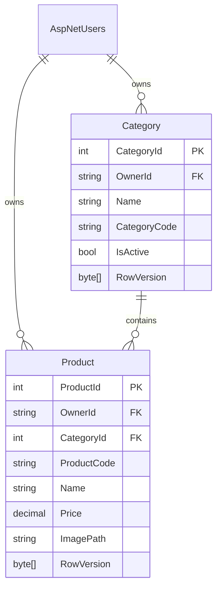

# ProductVault

ProductVault is a .NET 8 ASP.NET Core MVC application for securely managing a private catalogue of categories and products. It also exposes protected JSON API endpoints under `/api/categories` and `/api/products` for integration use.

## Highlights

- ASP.NET Core Identity registration and login; every data query is restricted to the signed-in user's `OwnerId`.
- Category CRUD with per-user unique codes validated as `ABC123`.
- Product CRUD with 10-item paging, image uploads, and database-backed optimistic concurrency (`rowversion`).
- Product codes automatically generated as `yyyyMM-###` inside a serializable transaction.
- Excel import (up to 500 rows) and complete Excel export.
- SQL Server / EF Core migrations, audit fields, antiforgery protection, validation, and error feedback.

## Prerequisites

- .NET 8 SDK
- SQL Server LocalDB (included with Visual Studio) or SQL Server Express/Developer edition

## Run locally

1. Restore packages: `dotnet restore`
2. Create the schema: `dotnet ef database update`
3. Run: `dotnet run`
4. Open the HTTPS URL displayed in the terminal and register an account.

The default connection is LocalDB in `appsettings.json`. For another SQL Server instance, replace `ConnectionStrings:DefaultConnection` with your server connection string; keep credentials out of source control by using user secrets or environment variables.

## Excel import layout

The first worksheet must have a header row, followed by these columns in order:

| Name | Description | Category Code | Price |
| --- | --- | --- | --- |
| Wireless mouse | Optional text | ACC001 | 249.99 |

The named category must already be active in the current user's account. Product codes are always generated by the system.

## Architecture

The solution uses a practical N-tier layout:

- **Presentation:** Razor MVC controllers/views and a protected REST API.
- **Application services:** product-code generation and Excel read/export services.
- **Domain:** `Category` and `Product` entities with audit and concurrency fields.
- **Infrastructure:** EF Core `ApplicationDbContext`, SQL Server, Identity, and local image storage.

## Data model

## API

The MVC session cookie protects the API, so sign in before calling it from an approved same-origin client.

- `GET`, `POST /api/categories`; `PUT /api/categories/{id}`
- `GET`, `POST /api/products`; `PUT`, `DELETE /api/products/{id}`

Product list requests accept `page` and `pageSize` (default 10). API clients must apply ordinary same-origin/XSRF protections when using cookie authentication.
