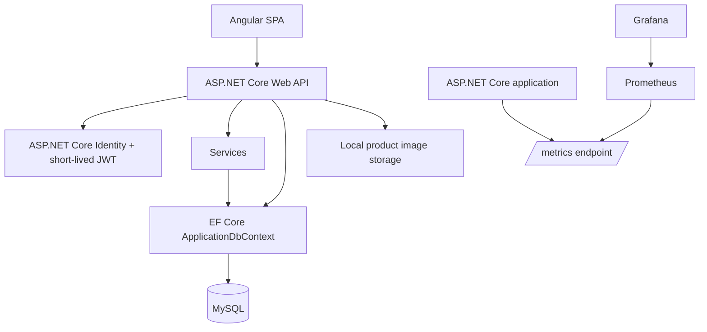

# Architecture

ProductVault is a modular monolith following a practical N-tier structure. The application is intentionally kept as one deployable unit because the requirements are centred on secure CRUD, not independently scaling services.

## Layers and responsibilities

| Layer | Main components | Responsibility |
| --- | --- | --- |
| Frontend | Angular standalone components, route guard, JWT interceptor | Render the SPA, validate forms, retain short-lived access tokens only in memory, and call the API with bearer tokens. |
| API | ASP.NET Core REST controllers, JWT authentication, rotating refresh sessions, CORS | Authorize requests, validate input, rotate/revoke browser sessions, and return JSON/file responses. |
| Application | `ProductCodeGenerator`, `ExcelProductService`, `EmailVerificationCodeService`, `SmtpEmailSender` | Hold reusable workflows such as product-code creation, CSV/XLSX conversion, email-code protection, and email delivery. |
| Domain | `Product`, `Category`, `AuditableEntity` | Represent catalogue rules, audit state, ownership, and concurrency data. |
| Infrastructure | EF Core, MySQL, Identity, local image storage | Persist data, authenticate users, store images, and apply migrations. |
| Observability | prometheus-net, Prometheus, Grafana | Collect request/business metrics and visualize them locally. |

## Key design choices

- **Modular monolith:** avoids distributed-system complexity while leaving clear boundaries for future extraction.
- **JWT boundary:** Angular owns the browser UI; the API verifies bearer tokens and derives the user ID server-side. The access token expires after 15 minutes and stays in memory; an `HttpOnly` refresh cookie restores it safely after a reload.
- **Ownership at query level:** every data read and mutation filters by the authenticated `OwnerId`.
- **Optimistic concurrency:** MySQL timestamp-backed concurrency tokens detect conflicting product/category edits.
- **Database constraints as safeguards:** indexes protect category-code and product-code uniqueness even if application logic is bypassed.
- **Retry-safe writes:** serializable product and import transactions execute through EF Core's MySQL retry strategy, so transient database failures do not bypass the write workflow.
- **Local-first monitoring:** `/metrics` is only mapped in Development; Grafana and Prometheus run through Docker Compose.
