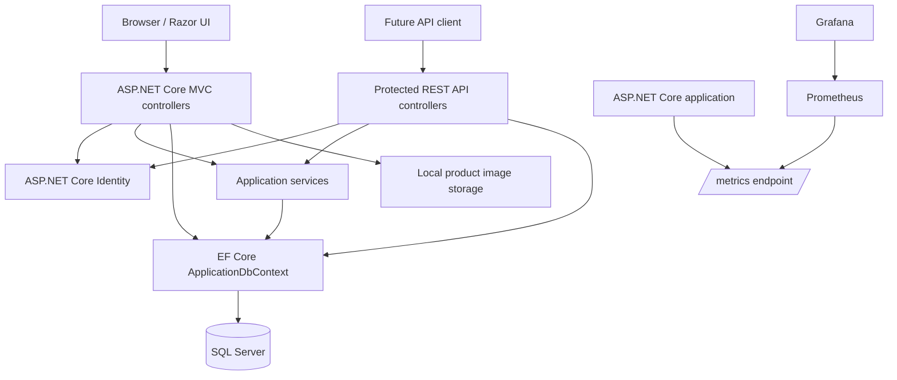

# Architecture

ProductVault is a modular monolith following a practical N-tier structure. The application is intentionally kept as one deployable unit because the requirements are centred on secure CRUD, not independently scaling services.

## Layers and responsibilities

| Layer | Main components | Responsibility |
| --- | --- | --- |
| Presentation | Razor views, MVC controllers, REST API controllers | Render screens, enforce request validation, return user-friendly errors. |
| Application | `ProductCodeGenerator`, `ExcelProductService` | Hold reusable business workflows such as product-code creation and Excel conversion. |
| Domain | `Product`, `Category`, `AuditableEntity` | Represent catalogue rules, audit state, ownership, and concurrency data. |
| Infrastructure | EF Core, SQL Server, Identity, local image storage | Persist data, authenticate users, store images, and apply migrations. |
| Observability | prometheus-net, Prometheus, Grafana | Collect request/business metrics and visualize them locally. |

## Key design choices

- **Modular monolith:** avoids distributed-system complexity while leaving clear boundaries for future extraction.
- **Ownership at query level:** every data read and mutation filters by the authenticated `OwnerId`.
- **Optimistic concurrency:** SQL Server `rowversion` detects conflicting product/category edits.
- **Database constraints as safeguards:** indexes protect category-code and product-code uniqueness even if application logic is bypassed.
- **Local-first monitoring:** `/metrics` is only mapped in Development; Grafana and Prometheus run through Docker Compose.
