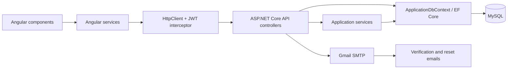
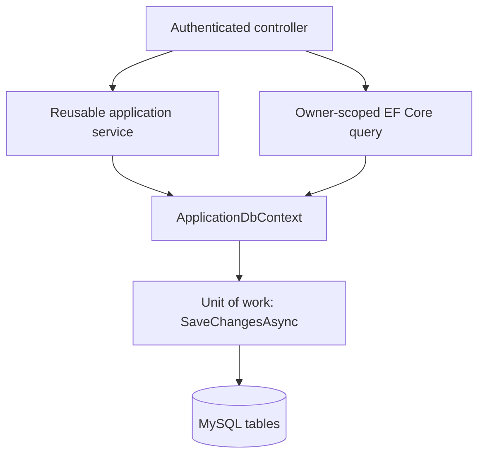

# ProductVault codebase and integration guide

This guide explains what each major part of ProductVault does and how a browser action becomes a database change. It is intended to be readable by a recruiter, interviewer, or a developer joining the project.

## 1. System at a glance

ProductVault is a modular monolith: one Angular frontend, one ASP.NET Core API, and one MySQL database. The modules are separated by responsibility, but they are deployed and developed together.



The frontend never connects directly to MySQL. It communicates only with the API over HTTP(S). The API authenticates the caller, applies business and ownership rules, and then uses Entity Framework Core to work with the database.

## 2. Frontend: Angular

The Angular application is in `frontend/src/app`. It uses standalone components and route-based feature boundaries.

| Area | Main files | Role |
| --- | --- | --- |
| Application shell | `app.component.ts` | Renders the navigation bar, switches it for signed-in and guest users, supports mobile navigation, and signs a user out before routing to the sign-in page. |
| Application setup | `app.config.ts`, `app.routes.ts` | Registers Angular services, the HTTP interceptor, and routes. Routes requiring a session are protected by the route guard. |
| API configuration | `core/api.config.ts` | Holds the API base URL so the frontend does not hard-code endpoint locations throughout the UI. |
| Authentication state | `core/auth.service.ts` | Registers and signs in users, verifies email codes, requests password resets, holds the short-lived JWT only in memory, restores a session through the rotating secure cookie flow, and exposes current authentication state and roles. |
| HTTP security | `core/auth.interceptor.ts` | Adds the in-memory bearer token to authenticated API requests and clears expired local state. Components do not need to repeat this security work. |
| Route protection | `core/auth.guard.ts` | Prevents unauthenticated users from opening dashboard, product, category, or import pages. |
| Catalogue API client | `core/api.service.ts` | Provides typed HTTP methods for dashboard, categories, products, downloads, and catalogue imports. |
| Shared contracts | `core/models.ts` | Defines the TypeScript shapes used by services and components when sending and receiving JSON. |
| Authentication pages | `features/auth/*` | Contains sign in, registration, email-code verification, resend-code, forgotten-password, and reset-password screens. |
| Dashboard | `features/dashboard/dashboard.component.ts` | Loads summary totals and recent products, then provides the main actions for adding or importing catalogue data. |
| Categories | `features/categories/categories.component.ts` | Lists, creates, edits, and deactivates the current user's categories. |
| Products | `features/products/products.component.ts` | Lists, filters, creates, edits, deletes, exports, and imports product data. |
| Import centre | `features/catalogue-import/catalogue-import.component.ts` | Gives users a guided CSV/XLSX import flow, a template download, and a clearly separated placeholder for a future provider integration. |
| Profile and admin pages | `features/profile/*`, `features/admin/*` | Let a user update their profile and password, and expose a role-protected account directory to the configured administrator. |
| Shared presentation | `styles.scss` and component styles | Provides responsive layout, accessible controls, focus states, and visual consistency across desktop and mobile sizes. |

### How a frontend component calls the backend

1. A user acts in a component, for example presses **Add product** or **Sign in**.
2. The component validates the form and calls a method on `AuthService` or `ApiService`.
3. That service uses Angular `HttpClient` to call an endpoint such as `POST /api/auth/login` or `POST /api/products`.
4. `auth.interceptor.ts` automatically attaches `Authorization: Bearer <token>` when a user is signed in. On application start, `AuthService` exchanges a valid rotating `HttpOnly` refresh cookie plus CSRF header for a fresh in-memory access token.
5. The API returns JSON, or a file for exports and templates.
6. The service maps the response back to the component, which updates its state and Angular renders the result.

This keeps presentation code separate from HTTP and session logic. A component owns the user experience; a service owns communication and reusable state.

## 3. Backend: ASP.NET Core

The API lives in `backend`. `Program.cs` is the composition root: it wires together configuration, database access, ASP.NET Identity, JWT validation, CORS, controllers, email delivery, metrics, and dependency injection.

| Area | Main files | Role |
| --- | --- | --- |
| Application startup | `Program.cs` | Configures MySQL, EF Core retry handling, Identity, JWT authentication, authorization, CORS, dependency injection, health checks, Swagger, and development metrics. |
| User model | `Models/ApplicationUser.cs` | Extends the ASP.NET Identity user with `FirstName` and `Surname`. The server generates a username such as `MMvelase`; email remains the sign-in address. |
| Catalogue models | `Models/Category.cs`, `Models/Product.cs`, `Models/AuditableEntity.cs` | Define the category/product data shape, owner identity, audit values, active status, and concurrency information. |
| Audit model | `Models/AuditEvent.cs` | Stores an immutable workspace activity record for catalogue, profile, and import actions. |
| Data access | `Data/ApplicationDbContext.cs` | Defines the EF Core model, Identity integration, `Categories` and `Products` sets, indexes, constraints, relationships, and concurrency mappings. |
| Database history | `Data/Migrations/*` | Versioned schema changes that create and evolve the MySQL database consistently. |
| Authentication controller | `Controllers/Api/AuthController.cs` | Registers users, creates short-lived JWT access responses plus secure refresh cookies, rotates/revokes sessions, verifies six-digit email codes, resends codes, and handles forgotten-password/reset-password requests. |
| Category controller | `Controllers/Api/CategoriesApiController.cs` | Supplies authenticated category CRUD while enforcing that a user can access only their own categories. |
| Product controller | `Controllers/Api/ProductsApiController.cs` | Supplies authenticated product CRUD, stock-movement history, image handling, product export, and the existing product Excel import flow. |
| Dashboard controller | `Controllers/Api/DashboardApiController.cs` | Calculates dashboard totals, supplies recent products, and supports development demo data. |
| Combined import controller | `Controllers/Api/CatalogueImportsApiController.cs` | Imports categories and products from CSV/XLSX, validates rows, creates missing categories, skips duplicates, and uses a transaction for the write workflow. |
| Product-code service | `Services/ProductCodeGenerator.cs` | Generates unique, meaningful product codes in one reusable place. |
| Spreadsheet service | `Services/ExcelProductService.cs` | Reads the supported CSV/XLSX format into validated import rows. It is used by the import boundary rather than being embedded in a controller. |
| Verification-code service | `Services/EmailVerificationCodeService.cs` | Creates cryptographically secure six-digit codes, stores only protected code values in Identity token storage, expires them after ten minutes, and limits incorrect attempts. |
| Refresh-token service | `Services/RefreshTokenService.cs` | Generates high-entropy browser session credentials, persists only SHA-256 hashes, rotates tokens on refresh, verifies CSRF values, and revokes individual or all user sessions. |
| Email sender | `Services/SmtpEmailSender.cs`, `Services/EmailOptions.cs` | Sends verification and reset messages through configured SMTP settings. In local development these settings can be supplied through .NET User Secrets instead of source control. |
| Identity roles | `Services/RoleBootstrapper.cs`, `Controllers/Api/AdminApiController.cs` | Creates the `User` and `Admin` roles, assigns every registration a user role, optionally promotes the configured administrator, and protects admin-only APIs. |
| Audit trail | `Services/AuditTrailService.cs` | Adds activity records alongside catalogue, profile, and import changes. |
| Observability | `Monitoring/ProductVaultMetrics.cs` | Defines business and request metrics that Prometheus can collect during development. |

### Controller, service, and class responsibilities

A controller is the HTTP boundary. It receives a request, checks request validity and authorization, calls the required application workflow, and returns an HTTP response. Controllers should not contain duplicated spreadsheet parsing, email delivery, or code-generation logic.

A service is reusable application logic. For example, `EmailVerificationCodeService` protects the verification-code lifecycle, while `ExcelProductService` understands the import-file format. Services are registered in `Program.cs` and supplied to controllers through dependency injection.

A class is the broader building block used to represent data or behavior. `Product` and `Category` are domain/data classes; `ApplicationUser` is an Identity data class; `EmailOptions` is a configuration class; and the services above are behavior classes.

## 4. Repository and database access

There is intentionally **no custom generic repository or `ProductRepository` class** in the current codebase. `ApplicationDbContext` is the data-access abstraction. Entity Framework Core already provides repository-like access through `DbSet<Product>` and `DbSet<Category>`, plus unit-of-work behavior through `SaveChangesAsync()`.

For this application size, wrapping every EF Core query in a generic repository would add another layer without reducing complexity. The controllers use `ApplicationDbContext` directly for concise, owner-scoped queries, while reusable workflows that deserve their own boundary are implemented as services.



This is a deliberate design choice, not a missing implementation. A dedicated repository becomes valuable later when the same complex query is used in several workflows, when data comes from multiple sources, or when a domain module needs a stricter persistence boundary.

### Database responsibilities

| Database area | Purpose |
| --- | --- |
| `AspNetUsers` and other `AspNet*` tables | Managed by ASP.NET Identity. Stores accounts, password hashes, confirmation state, token records, login metadata, and first/surname profile values. |
| `RefreshTokens` | Stores hashed refresh and CSRF secrets, expiry, revocation, and rotation metadata for server-revocable browser sessions. |
| `categories` | Stores each user's catalogue categories, category codes, active state, audit data, and concurrency value. |
| `products` | Stores products, prices, stock quantity, reorder level, image references, category relationship, ownership, audit data, and concurrency value. |
| `AuditEvents` | Stores owner-scoped history for catalogue, profile, import, and password-change actions. |
| `InventoryMovements` | Stores immutable owner-scoped stock changes with before/after quantities, an operation, note, actor, and timestamp. |
| `__EFMigrationsHistory` | Records which EF Core migrations have been applied to the database. |

The API gets the authenticated user ID from the JWT claims and filters catalogue queries by `OwnerId`. That is why one signed-in user cannot read or modify another user's products or categories merely by changing a browser URL or request ID.

## 5. Important end-to-end flows

### Registration and email-code verification

```mermaid
sequenceDiagram
    participant U as User
    participant R as Register component
    participant A as AuthService
    participant C as AuthController
    participant I as ASP.NET Identity
    participant V as Verification-code service
    participant E as SMTP email sender

    U->>R: Enter name, email, password
    R->>A: register(...)
    A->>C: POST /api/auth/register
    C->>I: Create ApplicationUser and password hash
    C->>V: Create protected six-digit code
    V->>E: Send email code
    E-->>U: Verification email
    U->>C: POST /api/auth/verify-email-code
    C->>I: Mark EmailConfirmed = true
    C-->>R: Success; frontend routes to sign in
```

The API uses `UserManager<ApplicationUser>` from Identity rather than handling password hashing itself. A user must have `EmailConfirmed` before `POST /api/auth/login` creates a 15-minute JWT access response and secure refresh session.

### Authenticated category or product change

1. The frontend application initializer restores an in-memory session from a valid rotating refresh cookie before the guard opens a private route.
2. The component calls `ApiService`; the interceptor attaches the JWT.
3. JWT middleware validates the token and makes the user identity available to the controller.
4. The controller filters the category/product by the authenticated `OwnerId`, validates the request, and applies the change through `ApplicationDbContext`.
5. EF Core translates the change into MySQL commands and saves it inside the configured database workflow.
6. The controller returns the updated JSON model, and the component refreshes its display.

### Catalogue import

1. The user downloads the documented template or selects a CSV/XLSX file in the Import Centre.
2. `CatalogueImportComponent` sends the file through `ApiService` to `POST /api/catalogue-imports/file`.
3. `CatalogueImportsApiController` confirms the caller, file type, file structure, row count, ownership, and data rules.
4. `ExcelProductService` reads the uploaded format into import rows.
5. The controller creates missing categories, generates product codes, skips duplicate rows, and saves valid work in a transaction.
6. The API returns imported/skipped counts and error details for the UI to show.

The Import Centre also presents a future integration endpoint. This makes the current file import usable now while showing where a supplier/PIM/ERP integration can later provide the same catalogue data through an authenticated API rather than a manual upload.

## 6. Configuration and local connections

| Connection | Development value | Where it is configured |
| --- | --- | --- |
| Angular to API | Angular development server to `https://localhost:7253` | `frontend/src/app/core/api.config.ts` |
| API to MySQL | MySQL `productvault` database | `ConnectionStrings:DefaultConnection`, normally in .NET User Secrets locally |
| API to browser origin | Localhost Angular origin(s) | CORS policy in `backend/Program.cs` |
| API to Gmail SMTP | Configured Gmail SMTP account and app password | `Email:*` settings, normally in .NET User Secrets locally |

Secrets such as database passwords, JWT signing keys, and SMTP app passwords must never be committed to the repository. Local setup is documented in the [operations runbook](operations-runbook.md).

## 7. Suggested explanation in an interview

> “ProductVault is an Angular and ASP.NET Core modular monolith. Angular components call focused client services; a JWT interceptor adds a short-lived in-memory access token, a rotating HttpOnly cookie restores sessions, and a route guard protects private pages. ASP.NET Core controllers are the secure HTTP boundary, while focused services handle reusable workflows such as email-code verification, refresh-token rotation, spreadsheet parsing, and product-code generation. Entity Framework Core’s `ApplicationDbContext` provides the repository and unit-of-work behavior for MySQL, with every catalogue query scoped to the authenticated owner. That gives the project clear boundaries without adding unnecessary repository boilerplate.”

For a concise feature-by-feature presentation, see the [interview walkthrough](interview-walkthrough.md) and [interview preparation cheat sheet](interview-prep.md).
