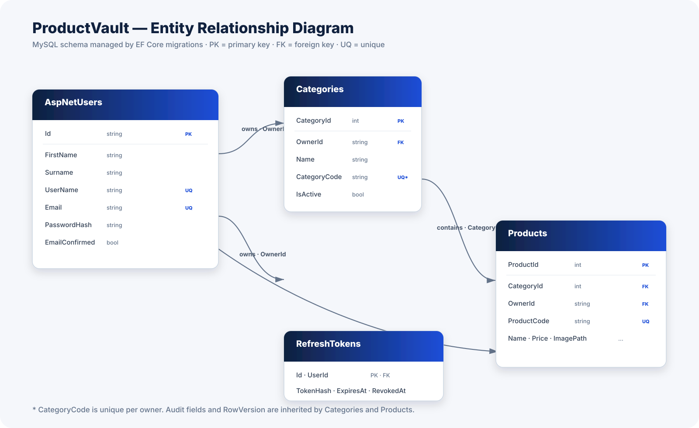

# Database schema

The schema is created by EF Core migrations and targets MySQL 8.0. A reviewable migration script is checked in at [`backend/Data/ProductVault.mysql.sql`](../backend/Data/ProductVault.mysql.sql); regenerate it with `dotnet ef migrations script` after schema changes.



The image focuses on the core ownership, catalogue, and session relationships. The append-only audit and inventory records are documented below; they retain identifiers as historical facts instead of relying on cascade-delete relationships.

```mermaid
erDiagram
    AspNetUsers ||--o{ Categories : owns
    AspNetUsers ||--o{ Products : owns
    AspNetUsers ||--o{ RefreshTokens : has
    AspNetUsers ||--o{ AuditEvents : records
    Categories ||--o{ Products : contains
    Products ||--o{ InventoryMovements : tracks

    AspNetUsers {
        string Id PK
        string FirstName
        string Surname
        string UserName
        string Email
        string PasswordHash
    }
    Categories {
        int CategoryId PK
        string OwnerId
        string Name
        string CategoryCode
        bool IsActive
        string CreatedBy
        datetime CreatedDate
        string UpdatedBy
        datetime UpdatedDate
        timestamp RowVersion
    }
    Products {
        int ProductId PK
        int CategoryId FK
        string OwnerId
        string ProductCode
        string Name
        string Description
        decimal Price
        string ImagePath
        string CreatedBy
        datetime CreatedDate
        string UpdatedBy
        datetime UpdatedDate
        timestamp RowVersion
    }
    RefreshTokens {
        int RefreshTokenId PK
        string UserId FK
        string TokenHash UQ
        datetime ExpiresAt
        datetime RevokedAt
    }
    AuditEvents {
        long AuditEventId PK
        string OwnerId
        string ActorId
        string Action
        datetime OccurredAt
    }
    InventoryMovements {
        long InventoryMovementId PK
        string OwnerId
        int ProductId
        string Operation
        int QuantityBefore
        int QuantityAfter
        datetime OccurredAt
    }
```

## Tables

| Table | Purpose | Important constraints |
| --- | --- | --- |
| `AspNetUsers` | ASP.NET Core Identity account store, including optional profile names for existing accounts. | Identity indexes for username and email lookups; new registrations generate `UserName` from first-name initial plus surname. |
| `Categories` | Private category catalogue for each user. | Unique `(OwnerId, CategoryCode)` index; `RowVersion` for concurrency. |
| `Products` | Private product catalogue for each user. | Unique `ProductCode`; FK to `Categories`; `RowVersion` for concurrency. |
| `RefreshTokens` | Hashed, rotating browser-session credentials and CSRF values. | Unique token hash; foreign key to `AspNetUsers`; expired or revoked sessions remain auditable. |
| `AuditEvents` | Append-only activity history for user-facing changes. | Indexed by owner and occurrence time; stores identifiers rather than a navigation graph. |
| `InventoryMovements` | Append-only stock adjustment history. | Indexed by owner, product ID, and occurrence time; preserves quantities before and after a change. |
| `__EFMigrationsHistory` | Tracks applied EF Core migrations. | EF Core managed. |

## Data-integrity rules

- Products cannot be deleted through a category delete because the relationship uses `DeleteBehavior.Restrict`.
- `Price` uses `decimal(18,2)` to avoid floating-point currency errors.
- `OwnerId` and `CreatedBy` are required for both domain tables.
- `RowVersion` is a MySQL timestamp-backed concurrency token that prevents lost updates.
- `AuditEvents` and `InventoryMovements` retain owner and entity identifiers as immutable history. They intentionally do not use cascade-delete relationships that could erase the history when a business record changes.

## RefreshTokens

Browser sessions are server-revocable. This table stores a SHA-256 hash of each refresh token and its paired CSRF value, never the raw cookie secrets. It also records expiry, revocation, and the replacement token hash produced during rotation. Each row belongs to one Identity user and is cascade-deleted if that account is deleted.

Product codes are globally unique; category codes are unique within the owning user's catalogue.
