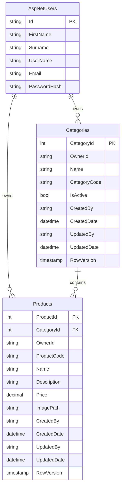

# Database schema

The schema is created by EF Core migrations and targets MySQL 8.0. A reviewable migration script is checked in at [`backend/Data/ProductVault.mysql.sql`](../backend/Data/ProductVault.mysql.sql); regenerate it with `dotnet ef migrations script` after schema changes.

## Tables

| Table | Purpose | Important constraints |
| --- | --- | --- |
| `AspNetUsers` | ASP.NET Core Identity account store, including optional profile names for existing accounts. | Identity indexes for username and email lookups; new registrations generate `UserName` from first-name initial plus surname. |
| `Categories` | Private category catalogue for each user. | Unique `(OwnerId, CategoryCode)` index; `RowVersion` for concurrency. |
| `Products` | Private product catalogue for each user. | Unique `ProductCode`; FK to `Categories`; `RowVersion` for concurrency. |
| `__EFMigrationsHistory` | Tracks applied EF Core migrations. | EF Core managed. |

## Data-integrity rules

- Products cannot be deleted through a category delete because the relationship uses `DeleteBehavior.Restrict`.
- `Price` uses `decimal(18,2)` to avoid floating-point currency errors.
- `OwnerId` and `CreatedBy` are required for both domain tables.
- `RowVersion` is a MySQL timestamp-backed concurrency token that prevents lost updates.
- Product codes are globally unique; category codes are unique within the owning user's catalogue.
