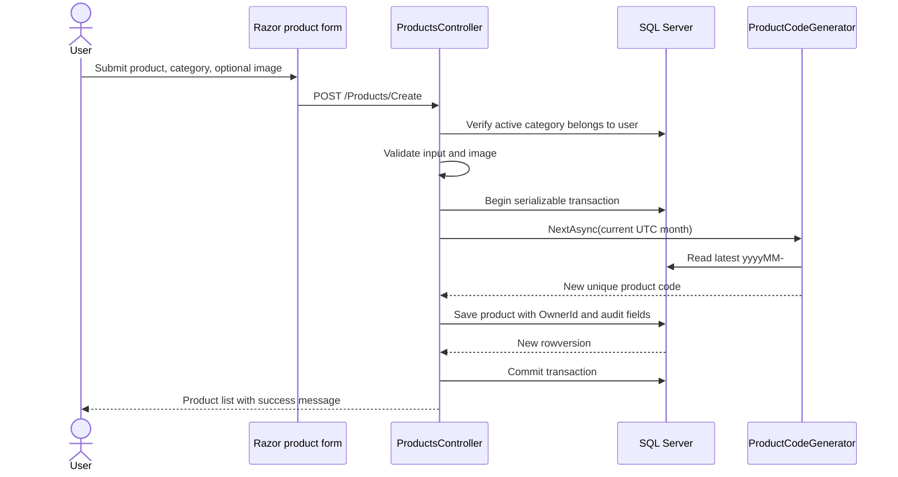
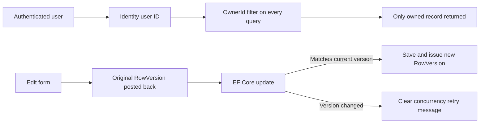
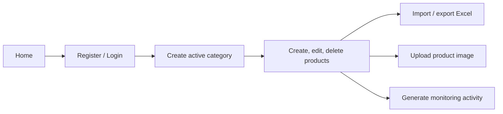

# Design diagrams

## Product creation flow

```mermaid
sequenceDiagram
    actor User
    participant UI as Razor product form
    participant Controller as ProductsController
    participant DB as SQL Server
    participant Code as ProductCodeGenerator

    User->>UI: Submit product, category, optional image
    UI->>Controller: POST /Products/Create
    Controller->>DB: Verify active category belongs to user
    Controller->>Controller: Validate input and image
    Controller->>DB: Begin serializable transaction
    Controller->>Code: NextAsync(current UTC month)
    Code->>DB: Read latest yyyyMM-### code
    Code-->>Controller: New unique product code
    Controller->>DB: Save product with OwnerId and audit fields
    DB-->>Controller: New rowversion
    Controller->>DB: Commit transaction
    Controller-->>User: Product list with success message
```

## Ownership and concurrency design

```mermaid
flowchart LR
    Login[Authenticated user] --> UserId[Identity user ID]
    UserId --> Query[OwnerId filter on every query]
    Query --> Owned[Only owned record returned]
    Edit[Edit form] --> Version[Original RowVersion posted back]
    Version --> Save[EF Core update]
    Save -->|Matches current version| Updated[Save and issue new RowVersion]
    Save -->|Version changed| Conflict[Clear concurrency retry message]
```

## Front-end flow

```mermaid
flowchart LR
    Home --> RegisterLogin[Register / Login]
    RegisterLogin --> Categories[Create active category]
    Categories --> Products[Create, edit, delete products]
    Products --> Excel[Import / export Excel]
    Products --> Image[Upload product image]
    Products --> Metrics[Generate monitoring activity]
```
