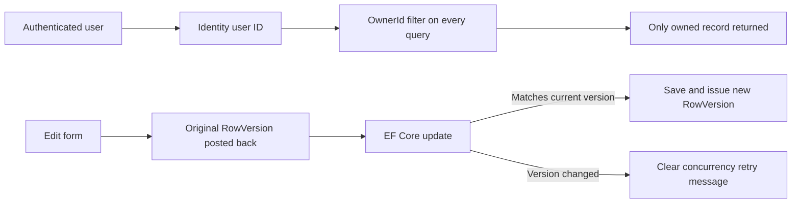
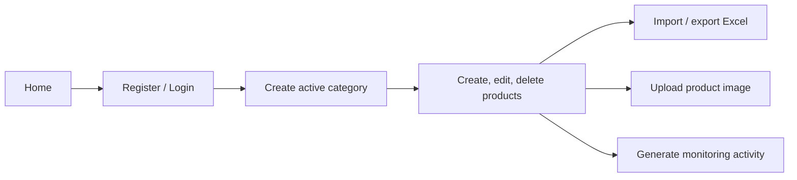

# Design diagrams

## Product creation flow

```mermaid
sequenceDiagram
    actor User
    participant UI as Angular product form
    participant Controller as ProductsApiController
    participant DB as MySQL
    participant Code as ProductCodeGenerator

    User->>UI: Submit product, category, optional image
    UI->>Controller: POST /api/products with bearer token
    Controller->>DB: Verify active category belongs to user
    Controller->>Controller: Validate input and image
    Controller->>DB: Begin serializable transaction
    Controller->>Code: NextAsync(current UTC month)
    Code->>DB: Read latest yyyyMM-### code
    Code-->>Controller: New unique product code
    Controller->>DB: Save product with OwnerId and audit fields
    DB-->>Controller: New rowversion
    Controller->>DB: Commit transaction
    Controller-->>User: JSON response; Angular refreshes product list
```

## Ownership and concurrency design



## Front-end flow



## Responsive design

The Angular UI uses fluid page spacing and typography, a mobile navigation menu, and 44px minimum interactive targets. Dashboard metrics collapse from three columns to one on smaller screens; filters and forms reflow into single-column controls; and catalogue tables retain every column through touch-friendly horizontal scrolling instead of hiding actions or data. Loading, saving, importing, exporting, and deleting states disable the relevant action and provide clear feedback to prevent duplicate requests.
